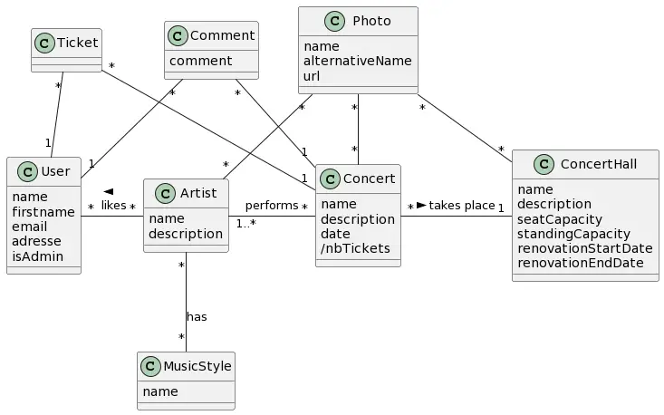

# projet Concert en Symfony

## bon à savoir
- pour avoir accès à tout le site il faut se connecter avec le compte administrateur (admin@admin.admin, superadmin)
- ce projet à été crée en local et n'es pas hébergé sur un serveur, pour le faire tourner il faudra changer la config de la base de données dans le .env
- une fois le serveur lancé, le projet est dispo à l'adresse http://localhost/chemin_de_la_racine_du_serveur_jusqu'au_projet/public/
- exemple, mon chemin : http://localhost/Symphony/concertProject/public/

## tout les attendus ont été remplis :
##### User :
- [x] accès en lecture aux concerts
- [x] accès à la création et modification d’un compte
- [x] accès à une page d’accueil qui affiche les prochains concerts à venir
##### Administrateur :
- [x] CRUD concert, artistes et salles de concerts (je n'ai pas de notion de groupe dans mon architecture)
##### général : 
- [x] un utilisateur n’a pas accès à tout le site, l’administrateur oui.
- [x] Créer un footer qui affiche l’adresse de la salle de concert.
- [x] Fixtures qui permet de remplir la BDD de façon automatique.
- [x] Quand je clique sur le nom d’un groupe, j’ai la liste de ses membres, mais
également une section : « leurs prochains concerts ».

## pour les nice to have :
- [x] Quand l’utilisateur est logué, au lieu de « Login », s’affiche dans la navBar : « Bonjour [nomUserLogué] », si vous créez un compte sans prénom alors on affichera l'email
- [x] afficher les concerts à venir en page d’accueil, aussi cliquable dans la section "A venir" de la NavBar
- [x] Une page qui affiche les concerts classés par année, voir onglet "Concerts par année" dans la NavBar
- [x] Gestion des favoris : sur la page "artists", quad on est connecté on peut like/dislike des artists. Utile car les artists liké s'affichent en haut de la page, permettant de retrouver plus rapidement les infos et concerts qui nous intéressent.

## le diagramme de classe validé au début du projet :

 
notons que le diagramme de classe était assez gourmand et que tout n'as pas été implémenté dans le site. Ce sera des pistes si j'ai envie de reprendre le projet !